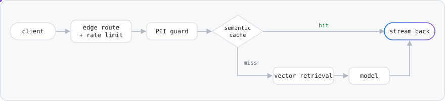

<a href="https://bayar.dev">
  <picture>
    <source media="(prefers-color-scheme: dark)" srcset="./assets/header-dark.svg">
    
  </picture>
</a>

<p align="center">
  <a href="https://bayar.dev"></a>
  <a href="https://bayar.dev/docs"></a>
  <a href="https://www.linkedin.com/in/bayardev"></a>
  <a href="https://x.com/bayardotdev"></a>
  <a href="mailto:hi@bayar.dev"></a>
</p>

I'm **Bayar**, the solo founder of [**bayar.dev**](https://bayar.dev). I build AI infrastructure: streaming pipelines, edge routing, and the guardrails between your users and the model.

```ts
const bayar = {
  building:  "bayar.dev — AI infrastructure & autonomous business workflows",
  stage:     "early, bootstrapped, shipping",
  focus:     ["streaming AI", "edge routing", "rate limiting", "semantic caching",
              "PII redaction", "vector retrieval", "private VPC / BYOK"],
  daily:     "CachyOS + Hyprland (Noctalia shell), kitty + fish, way too many terminals",
  based:     "Walnut Creek, CA",
};
```

### What a request looks like on bayar.dev

<picture>
  <source media="(prefers-color-scheme: dark)" srcset="./assets/flow-dark.svg">
  
</picture>

### Stack

<p>
  
  
  
  
  
  
  
  
  
</p>

### Public work

| Project | What it is |
| --- | --- |
| [**starfall-arcade**](https://github.com/namchinbayar/starfall-arcade) | A tiny cosmic browser game, deployed with AWS CDK |
| [**@bayardotdev**](https://github.com/bayardotdev) | The bayar.dev organization |

### Contributions

<picture>
  <source media="(prefers-color-scheme: dark)" srcset="https://raw.githubusercontent.com/namchinbayar/namchinbayar/output/snake-dark.svg">
  
</picture>

<sub>ORCID <a href="https://orcid.org/0009-0001-5896-7447">0009-0001-5896-7447</a> · commits signed with SSH via 1Password</sub>
